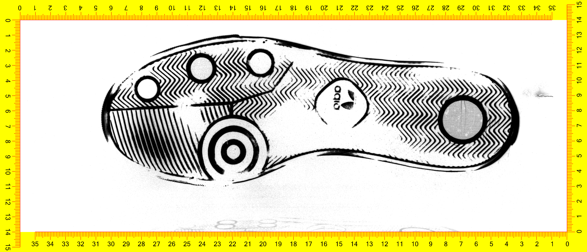
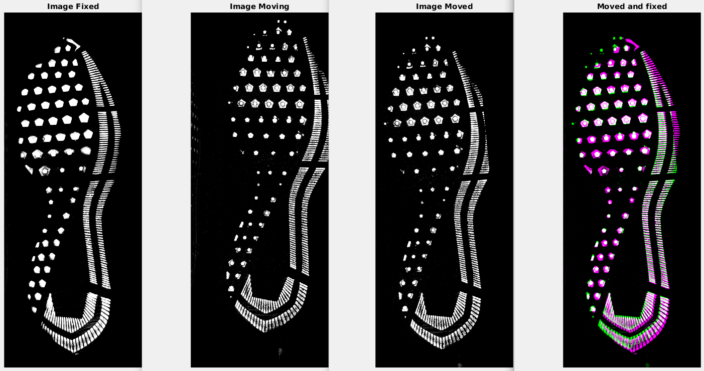
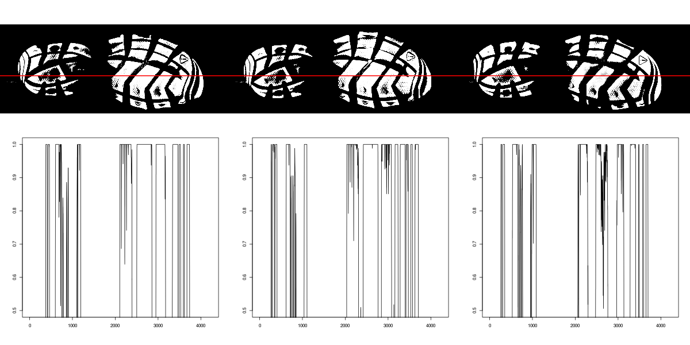

# Shoeprint Alignment for Feature Extraction

## Image Database

- We are working with the EverOS 2D scanner images
- This collection has scans from around 150 pairs of shoes
- Each shoe was scanned four times, with four replicates each time
- There are four different sizes of two different brand/models

  

## Main Objective

To develop an automatic algorithm to match two scans corresponding to the same shoe based on analysis of cross-section

In order to do this we need:

1. Align images so we can identify the same cross-sections on all the shoes
1. Identify the areas with the most potential for discrimination
1. Extract cross-section signatures in such areas
1. Study the correlationn of cross-section on both match and non-match pairs
1. Use the cross-section signatures to construct informative features
1. Fit and asses statistical models

## Shoeprint image registration/alignment

- After a variety of attemps, the best way to proceed is using the MATLAB function "imregister"
- Even with the orignal size of the images (approx. 4000 x 2000 pixels) an alignment takes up to one minute on a regular laptop
- The MATLAB method is robust enought to align the images even when the positions are quite different
- Just few times (less than 10% of the cases) it's neceesary to re-run the function with an adjusted parameter

## Alignment Example

## Next Steps

- It's necessary to align all the images (different sizes and brand/models) to a similar position
- We need this to be able to talk about the same cross-section regarless of size and brand/model
- Then we will be able to determine the areas of the shoesole with the most potential for discrimination

## Example of a Cross-Section

